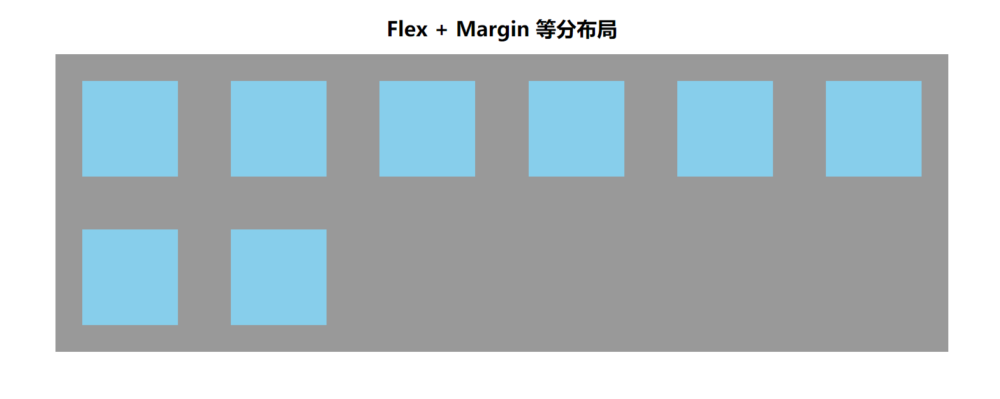
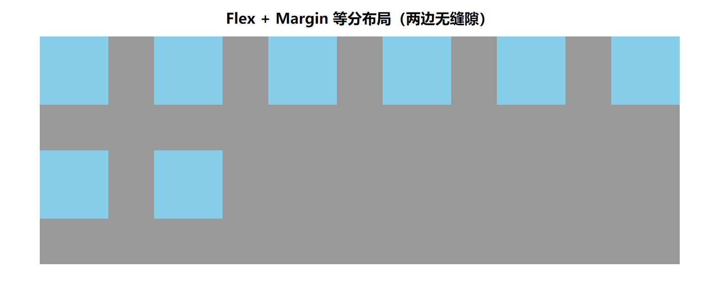

# CSS 小知识

## 1、常用样式

### 1.1 文本溢出处理

1. 单行文本省略

```css
.text-ellipsis {
  overflow: hidden;
  text-overflow: ellipsis;
  white-space: nowrap;
}
```

2. 多行文本省略

```css
.text-ellipsis-more {
  overflow: hidden;
  text-overflow: ellipsis;
  display: -webkit-box;
  -webkit-line-clamp: 2;
  /* 限制在一个块元素显示的文本的行数 */
  -webkit-box-orient: vertical;
  /* 垂直排列 */
}
```

### 1.2 滤镜 の 全站灰白

```css
html,
body {
  filter: grayscale(1);
}
```

常用于纯`HTML`、`CSS`实现**_回到顶部_**平滑滚动效果

### 1.3 宽高

1.  内容适应宽度

```css
.content-adaptation-width {
  width: fit-content;
  width: -moz-fit-content; /* 兼容火狐 */
}
```

## 2、布局

### 2.1、等分布局 flex + margin



```html
<!DOCTYPE html>
<html lang="zh">
  <head>
    <meta charset="UTF-8" />
    <meta name="viewport" content="width=device-width, initial-scale=1.0" />
    <title>flex + margin 等分布局</title>
    <style>
      * {
        margin: 0;
        padding: 0;
        box-sizing: border-box;
      }
      header {
        text-align: center;
        margin: 40px 0 20px;
      }

      main {
        margin: 0 auto;
        width: 1400px;
        background-color: #999;
        display: flex;
        flex-wrap: wrap;
        align-items: flex-start;
        align-content: flex-start;
      }
      /* 主要代码 */
      main .item {
        --n: 6;
        --space: calc(100% - var(--n) * 150px);
        --h: calc(var(--space) / var(--n) / 2);
        width: 150px;
        height: 150px;
        margin: var(--h);
        /* end */
        background-color: skyblue;
      }
    </style>
  </head>
  <body>
    <header>
      <h1>Flex + Margin 等分布局</h1>
    </header>
    <main>
      <div class="item"></div>
      <div class="item"></div>
      <div class="item"></div>
      <div class="item"></div>
      <div class="item"></div>
      <div class="item"></div>
      <div class="item"></div>
      <div class="item"></div>
    </main>
  </body>
</html>
```

### 2.2、等分布局 flex + margin(两边无缝隙)



```html
<!DOCTYPE html>
<html lang="zh">
  <head>
    <meta charset="UTF-8" />
    <meta name="viewport" content="width=device-width, initial-scale=1.0" />
    <title>flex + margin 等分布局(两边无缝隙)</title>
    <style>
      * {
        margin: 0;
        padding: 0;
        box-sizing: border-box;
      }
      header {
        text-align: center;
        margin: 40px 0 20px;
      }

      main {
        margin: 0 auto;
        width: 1400px;
        background-color: #999;
        display: flex;
        flex-wrap: wrap;
        align-items: flex-start;
        align-content: flex-start;
      }
      /* 主要代码 */
      main .item {
        --n: 6;
        --space: calc(100% - var(--n) * 150px);
        --h: calc(var(--space) / calc(var(--n) - 1));
        width: 150px;
        height: 150px;
        margin-right: var(--h);
        margin-bottom: var(--h);
        /* end */
        background-color: skyblue;
      }
      main .item:nth-child(6n + 6) {
        margin-right: 0;
      }
    </style>
  </head>
  <body>
    <header>
      <h1>Flex + Margin 等分布局（两边无缝隙）</h1>
    </header>
    <main>
      <div class="item"></div>
      <div class="item"></div>
      <div class="item"></div>
      <div class="item"></div>
      <div class="item"></div>
      <div class="item"></div>
      <div class="item"></div>
      <div class="item"></div>
    </main>
  </body>
</html>
```

## 3、媒体查询

```css
/* media-adaptation.css */
/* 媒体自适应 */

/* 小于 768px 《===》xs */
@media only screen and (max-width: 767px) {
  /* 在这里编写小于 768px 时应用的 CSS */
}

/* 大于等于 768px 《===》sm */
@media only screen and (min-width: 768px) {
  /* 在这里编写大于等于 768px 时应用的 CSS */
}

/* 大于等于 992px 《===》md */
@media only screen and (min-width: 992px) {
  /* 在这里编写大于等于 992px 时应用的 CSS */
}

/* 大于等于 1200px 《===》lg */
@media only screen and (min-width: 1200px) {
  /* 在这里编写大于等于 1200px 时应用的 CSS */
}

/* 大于等于 1920px 《===》xl */
@media only screen and (min-width: 1920px) {
  /* 在这里编写大于等于 1920px 时应用的 CSS */
}
```
