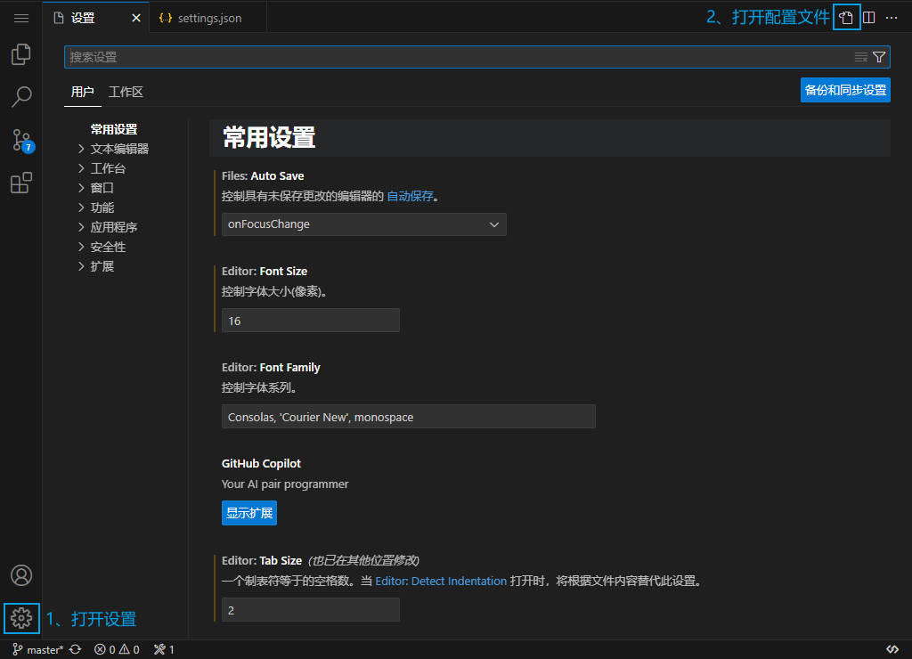

# VsCode

## 1、核心配置

::: details 如何打开配置文件？

1. 打开设置
2. 打开配置文件


:::

```json
{
  // 菜单栏只显示菜单图标
  "window.menuBarVisibility": "compact",
  // 将命令启动器与窗口标题栏分开
  "window.commandCenter": false,
  // 禁用布局控件
  "workbench.layoutControl.enabled": false,
  // 自动更新已启用的扩展
  "extensions.autoUpdate": "onlyEnabledExtensions",
  // 在没有从上一会话中恢复出信息的情况下，不打开编辑器
  "workbench.startupEditor": "none",
  // 文件图标主题
  "workbench.iconTheme": "material-icon-theme",
  // 编辑器字体大小
  "editor.fontSize": 16,
  // 一个制表符等于的空格数
  "editor.tabSize": 2,
  // 编辑器折行的方式：较小值处折行
  "editor.wordWrap": "bounded",
  // 优化鼠标样式
  "editor.cursorBlinking": "smooth",
  // 自动重命名HTML标签
  "editor.linkedEditing": true,
  // 彩虹括号配置 1
  "editor.guides.bracketPairs": true,
  // 彩虹括号配置 2
  "editor.guides.bracketPairsHorizontal": "active",
  // 彩虹括号配置 3
  "editor.bracketPairColorization.independentColorPoolPerBracketType": true,
  // 彩虹括号配置 4
  "editor.defaultColorDecorators": true,
  // 控制活动代码段是否阻止代码提示
  "editor.suggest.snippetsPreventQuickSuggestions": false,
  // 控制是否应自动关闭括号、引号和括号
  "editor.autoClosingBrackets": "languageDefined",
  // 保存时自动格式化
  "editor.formatOnSave": true,
  // 自动格式化粘贴内容
  "editor.formatOnPaste": true,
  // 默认格式化工具 - Prettier - Code formatter 插件
  "editor.defaultFormatter": "esbenp.prettier-vscode",
  // 当编辑器失去焦点时，自动保存
  "files.autoSave": "onFocusChange",
  // 排除文件和文件夹
  "files.exclude": {
    "**/node_module": true
  },

  // 默认终端 - Git
  "terminal.integrated.defaultProfile.windows": "Git Bash",
  // 终端组合键绑定
  "terminal.integrated.allowChords": false,
  // 删除文件确认
  "explorer.confirmDelete": false,
  // 拖放移动文件或文件夹时确认
  "explorer.confirmDragAndDrop": false,
  // 自动更新导入路径
  "javascript.updateImportsOnFileMove.enabled": "always",
  // 始终允许不受信任的文件引入受信任的工作区，而不显示提示
  "security.workspace.trust.untrustedFiles": "open",
  // 允许提示用户对 Intellisense 使用在工作区中配置的 TypeScript 版本
  "typescript.enablePromptUseWorkspaceTsdk": true,

  // Git 配置 - Start
  "git.enableSmartCommit": true,
  "git.confirmSync": false,
  "git.ignoreRebaseWarning": true
  // Git 配置 - End
}
```

## 2、插件推荐

### 2.1 语言

::: tip **Chinese (Simplified) (简体中文)**
VS Code 中文（简体）语言包
:::

::: tip **Comment Translate**
VSCode 注释翻译；详情配置见 QQ 收藏
:::

### 2.3 CSS

::: tip **CSS Peek**
将 CSS 的 ID 和类字符串作为从 html 文件到相应 CSS 的定义进行查询

允许速览和转到定义

`Ctrl + 左键`可以直接定位到该名称 CSS 的位置
:::

::: tip **IntelliSense for CSS class names in HTML**
智能感知 HTML 中的 CSS 类名

实现 BootStrap、Layui 等 UI 库的样式类名提示
:::

::: tip **HTML CSS Support**
补充缺少的 CSS 支持

类属性补全、ID 属性补全和全文件搜索 CSS 和 SCSS 提示等
:::

::: tip **vscode-styled-components**
样式化组件的语法突出显示和智能感知；

在 JavaScript 中提示 CSS 样式
:::

### 2.4 JavaScript

::: tip **JavaScript Snippet Pack**
一个片段包，让你更有效地使用 JavaScript
:::

::: tip **Inline Parameters for VSCode**
显示的函数参数注释
:::

::: tip **Parameter Hints**
自动参数提示
:::

### 2.5 Vue

::: tip **Vetur**
Vue 2 语言支持
:::

::: tip **Vue Language Features (Volar)**
Vue 3 语言支持
:::

::: tip **TypeScript Vue Plugin (Volar)**
Vue 3 + TypeScript 语言支持
:::

::: tip **VueHelper**
Vue，Vue-Router 和 Vuex 的代码片段
:::

::: tip **vue-helper**
增强 Vue 和 Element-UI，VUX，IVIEW 的扩展能力
:::

::: tip **vue-helper**
增强 Vue 和 Element-UI，VUX，IVIEW 的扩展能力
:::

::: tip **Vue 3 Snippets**
Vue 2 和 Vue3 代码片段
:::

::: tip **vue-component**
轻松使用 vue 组件
:::

### 2.6 组件库

::: tip **element-ui-helper**
文档悬停提示和自动完成工具
:::

::: tip **vscode-element-helper**
Element-UI 代码片段
:::

### 2.7 Git

::: tip **GitLens — Git supercharged**
通过 Git 责备注释和 CodeLens 一目了然地可视化代码创作
:::

::: tip **Git History Diff**
查看 Git 历史记录、责备信息、存储详细信息、已提交文件的差异
:::

### 2.8 路径

::: tip **Path Autocomplete**
路径自动完成
:::

::: tip **Path Intellisense**
路径智能感知
:::

::: tip **别名路径跳转**
别名路径跳转插件，支持任何项目，可以自由配置映射规则，自由配置可缺省后缀名列表
:::

### 2.9 代码运行

::: tip **Live Server**
启动一个本地开发服务器，为静态动态页面提供实时重新加载功能
:::

::: tip **open in browser**
快速使用本地浏览器打开 HTML 文件
:::

::: tip **Code Runne**
强大的代码运行程序
:::

### 2.10 图标美化

::: tip **vscode-icons**
超级好看的文件图标 icon
:::

::: tip **Material Icon Theme**
超级好看的文件图标 icon
:::

### 2.10 美化

::: tip **Image preview**
在装订线和悬停时显示图像预览
:::

::: tip **indent-rainbow**
使缩进更具可读性 - 彩虹缩进
:::

::: tip **Template String Converter**
模板字符串转换器
:::

### 2.11 代码格式化

::: tip **Prettier - Code formatter**
更漂亮的格式化程序

依赖配置插件: `PrettierConfig for VS Code`
:::

::: tip **PrettierConfig for VS Code**
配置插件
:::

### 2.12 AI 代码

::: tip **CodeGeeX**
智能编程助手
:::

### 2.12 uni-app

::: tip **uni-create-view**
快速创建页面
:::

::: tip **uni-helper**
uni-app 代码提示
:::

::: tip **uniapp 小程序扩展**
鼠标悬停查文档
:::

## 3、插件配置

### 3.1 @别名路径提示

**方案一**

::: info Path Autocomplete 配置扩展设置 - PathMappings

```json
"path-autocomplete.pathMappings": {
  "@": "${folder}/src"
}
```

:::

**方案二**

::: info Path Intellisense 配置扩展设置 - Mappings

```json
"path-intellisense.mappings": {
  "@": "${workspaceFolder}/src"
},
```

:::

### 3.2 Comment Translate 配置

```json
{
  "commentTranslate.source": "intellsmi.comment-translate-ali.cloud",
  "commentTranslate.targetLanguage": "zh-CN",
  "commentTranslate.translationAli.accessKeyId": "xxxx",
  "commentTranslate.translationAli.accessKeySecret": "xxxx",
  "commentTranslate.googleTranslate.tld": "cn",
  "commentTranslate.ignore": [
    {
      "languageId": "javascript,typescript,javascriptreact,typescriptreact",
      "regular": "[\\*\\s]+"
    },
    {
      "languageId": "dart",
      "regular": "[\\s|/]+"
    }
  ],
  "commentTranslate.hover.variable": true,
  "commentTranslate.hover.concise": true
}
```

## 4、项目环境配置

> 在**根目录**下创建文件`jsconfig.json`或`tsconfig.json`

- 即使项目中没有使用 TypeScript，也可以使用此文件来获得更好的 IDE（集成开发环境）支持
- 比如更准确的代码自动补全、语法提示、路径别名、导航和类型检查等等

```json
{
  "compilerOptions": {
    // 指定用于解析非相对模块名称的基目录
    "baseUrl": "./",
    // 类型支持
    "types": ["element-plus/global"],
    // 路径别名
    "paths": {
      "@/*": ["src/*"]
    }
  },
  "exclude": ["node_modules", "dist"]
}
```

## 5、控制台权限不足

> `Windows`平台下，如`node`、`npm`、`tsc`等命令在`VsCode`控制台执行时，发生报错

**错误如下**

```bash
xxx : 无法加载文件 xxxx，因为在此系统上禁止运行脚本。有关详细信息，请参阅 https:/go.microsoft.com/fwlink/?LinkID=135170 中的 about_Execution_Policies。
```

**解决方案**

1.  `Win` + `X`
2.  运行`Windows PowerShell(管理员)`
3.  执行命令

```bash
set-ExecutionPolicy RemoteSigned
```

4.  输入`Y`，回车；关闭窗口，重启 VsCode

## 6、在 VsCode 中代码调试

> 演示


### ✨1、添加配置

1. 在`.vscode`目录下新建`launch,json`文件
2. 添加如下配置

```json
{
  "version": "0.2.0",
  "configurations": [
    {
      "type": "chrome",
      "request": "launch",
      "name": "dev",
      "url": "http://localhost:5173", // Replace with your project's local URL
      "webRoot": "${workspaceFolder}",
      "runtimeExecutable": "stable" // Use the "stable" or custom browser path
    }
  ]
}
```

3. 根据需要修改`url`和`runtimeExecutable`


---

注：`runtimeExecutable`默认使用`stable`即可，若提示错误，请将该值改为`浏览器地址`

例如`Google Chrome`浏览器（Win）：

```bash
C:/Program Files/Google/Chrome/Application/chrome.exe
```

### ✨2、启动调试

1. 在代码文件中添加**断点**（红框位置，鼠标单击）


2. 在左侧工具栏中，选择`调试`，运行`dev`即可


