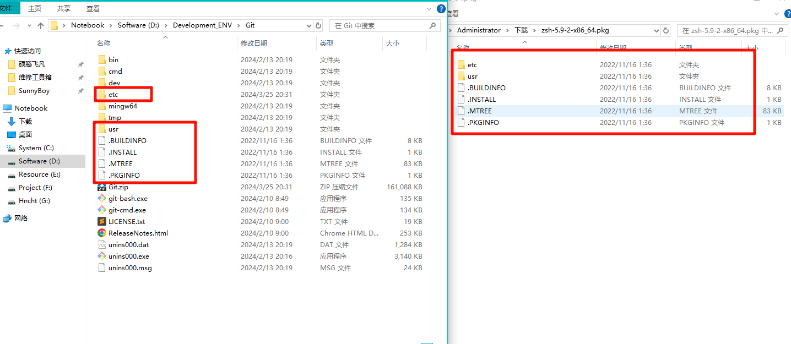
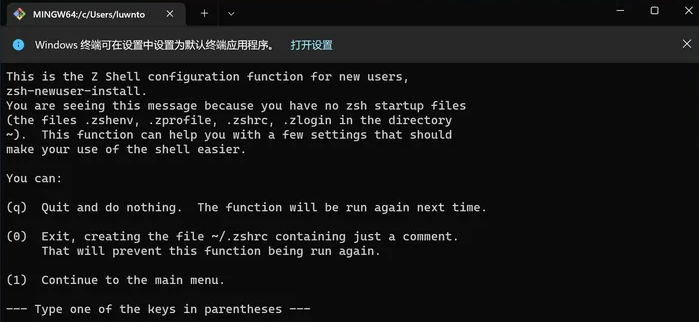
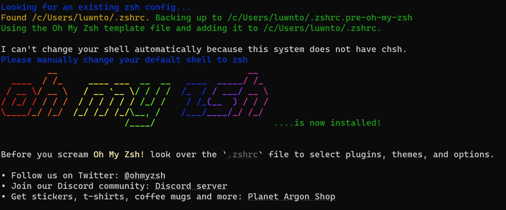
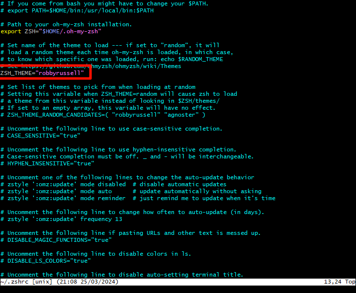
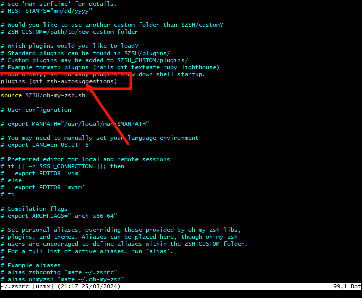

# ZSH 终端(Win)

> `zsh`提供了更强大、更灵活的自动补全功能。它不但可以自动补全命令，设置选项、参数甚至文件名，都可自动补全

> 本文以`Git Bash`终端为基础，安装`zsh`和`oh-my-zsh`

## 1、安装 ZSH

1. 下载[ZSH 安装包](https://packages.msys2.org/package/zsh?repo=msys&variant=x86_64)


2. 将文件解压在`Git`根目录



3. 右键打开 `Git bash` 输入 `zsh`，出现下图则安装成功



4. 输入 `0` 结束并生成 `.zshrc` 配置文件

> 区分 `bash` 和 `zsh`，`bash`的光标在第二行，`zsh`的光标在同一行

## 2、设置默认启动

1. 通过编辑 `Bash` 终端的配置文件 `.bashrc` 来实现默认使用 `Zsh`
2. 在 `Git Bash` 终端中输入命令

```bash
vim ~/.bashrc
```

3. 在配置中新增代码

```bash
if [ -t 1 ]; then
  exec zsh
fi
```

> 按小写 `i` 进入插入模式，之后粘贴或写入内容，按 `Esc` 退出插入模式，然后输入冒号 `:` 进入尾行模式，在尾行模式输入小写 `wq` 最后按回车键，保存退出

## 3、安装 Oh My Zsh

1. 在`zsh`终端中执行命令

```bash
sh -c "$(curl -fsSL https://raw.githubusercontent.com/ohmyzsh/ohmyzsh/master/tools/install.sh)"
```

> 安装 ozsh 报错，可以把`raw.githubusercontent.com`换成`raw.gitmirror.com`(镜像网站)即可



> 最后一行的 `ERROR` 可以忽略

## 4、配置 ZSH 主题

1. 终端输入

```bash
vim ~/.zshrc
```

> `Oh My Zsh` 安装默之后，默认使用主题是 `robbyrussell`，可以修改 `.zshrc` 配置中的 `ZSH_THEME` 字段，所有可用主题可参考[ohmyzsh 官方文档](https://github.com/ohmyzsh/ohmyzsh/wiki/Themes)



2. 重载配置

```bash
source ~/.zshrc
```

## 5、配置 ZSH 插件

> 示例：`zsh-autosuggestions`-自动补全
>
> 描述：历史指令中找到与你当前输入指令匹配的记录，并高亮显示，如果想直接使用，可以直接通过右方向键补全

1. 安装命令

```bash
cd ~/.oh-my-zsh/custom/plugins

git clone https://github.com/zsh-users/zsh-autosuggestions ${ZSH_CUSTOM:-~/.oh-my-zsh/custom}/plugins/zsh-autosuggestions
```

2. 启用插件

```bash
vim ~/.zshrc
```

- 在`plugins=(...)`中添加插件，以空格进行分隔



3. 保持并重启 ZSH

```bash
source ~/.zshrc
```

---

**Vim 小知识**

- 打开文件`vim xxx`
- 按`i`进入编辑模式
- 按`esc`退出编辑模式
- 输入`:wq`退出并保持
