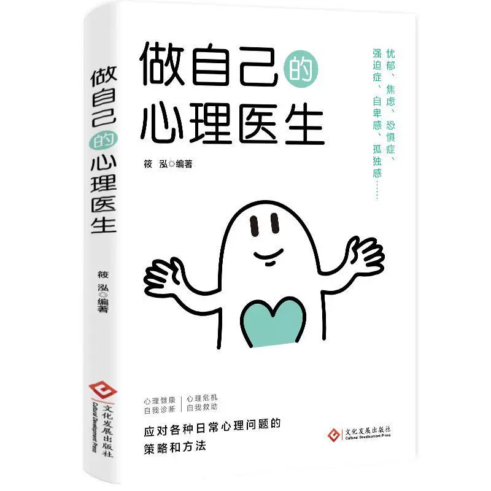
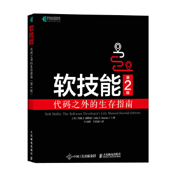

# 书单墙

## 2024 年

|                 书名                  |                                                           封面                                                            |                                                                       导语                                                                        |                                 感悟                                 |
| :-----------------------------------: | :-----------------------------------------------------------------------------------------------------------------------: | :-----------------------------------------------------------------------------------------------------------------------------------------------: | :------------------------------------------------------------------: |
|           做自己的心理医生            |  |                           每个人都是自己的心理医生；认识自我、激发内心深处的自愈力；让貌似正常心有小恙的人自愈并改变。                            | 总有一天你会明白，能够治愈你的从来都不是时间，而是心里的释怀和格局。 |
| 软技能：代码之外的生存指南（第 2 版） |                                                  | 程序员、软件开发人员职业生涯指南，凸显技术中"人"的因素，聆听软件开发人员人生导师 John Z.Sonmez 的经验之谈，讲解 IT 行业从业者所需要知道的"软技能" |      一名成功的软件开发人员——不能只编写代码，还要有精彩的人生。      |
